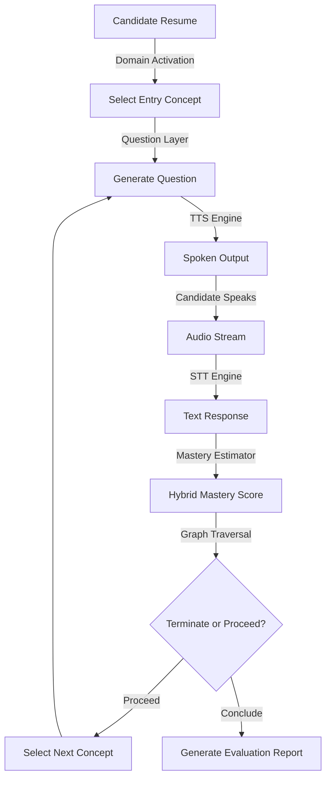

# Nephele Architecture Guide

This document details the high-level design, software modules, database schemas, and runtime pipelines that power Nephele.

---

## 1. System Overview

Nephele is an AI-guided adaptive technical interview platform. Instead of presenting a linear list of questions, Nephele modelizes candidate knowledge using a **Knowledge Graph**. The system navigates this graph dynamically, selecting concepts, generating matching questions, and estimating concept mastery in a real-time feedback loop.

---

## 2. Core Subsystems

### A. Knowledge Graph
- **Domain Graph JSONs**: Located in `knowledge_graph/domains/` (e.g., `machine_learning.json`, `python.json`).
- Defines concepts (name, description, common misconceptions, difficulties) and prerequisite-dependency edges.
- Loaded into memory as Pydantic models.

### B. Domain Activation & Entry Concept Selection
- Inspects candidate resume details (extracted text, projects, skills).
- Scores matching domains and identifies the optimal starting node.

### C. Mastery Estimator
- Graded using a hybrid evaluator:
  - **Rubric Evaluator**: Compares responses to conceptual evidence lists.
  - **LLM Evaluator**: Generates descriptive commentary and mastery score grades.
- Supports provider adapters for **Groq**, **Gemini**, and **OpenAI**.

### D. Graph Traversal Engine
- Adapts to candidate performance:
  - **Acceleration**: Skip intermediate prerequisite concepts if candidate scores 1.0 twice consecutively.
  - **Cycle Protection**: Prevents re-visiting already graded concept nodes.
  - **Branch Termination**: Conclude assessment if failure streak (score <= 0.40) exceeds threshold.

### E. Voice Runtime Lifecycle
- Handles real-time streaming:
  - **STT**: AssemblyAI websocket stream or local mock fallback.
  - **TTS**: Local pyttsx3 voice synthesis or mock fallback.
  - **Camera Adapter**: Derives engagement and eye-contact indices from head pose pitch and yaw.

---

## 3. Storage Architecture

### PostgreSQL
Relational database storing candidate information, session states, concept traversal progressions, and metrics:
- `candidates`: Primary demographic records.
- `resume_data`: Extracted resume skills and text.
- `interview_sessions`: Active traversal states, streaks, and paths.
- `concept_evaluations`: Detailed grading logs per turn.
- `domain_mastery`: Aggregated domain score averages.
- `interview_reports`: Final summaries and recommended study guides.
- `provider_metrics`: Token expenditures and execution latencies.
- `graph_edge_statistics`: Historical edges traversal strength metrics.

### ChromaDB
Vector database storing unstructured text embeddings for semantic matching:
- `questions`: Historical questions cache.
- `answers`: Successful candidate responses.
- `misconceptions`: Mined wrong answers.
- `concept_examples`: High-quality reference answers.
