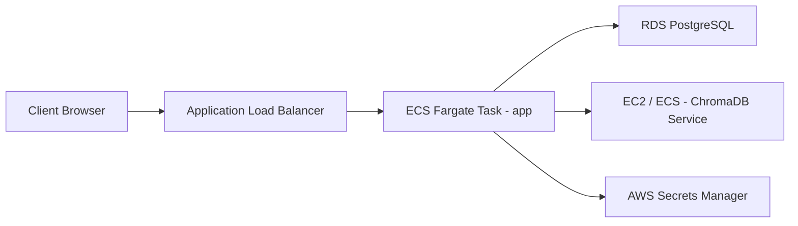

# Nephele Deployment Guide

This guide describes how to configure, run, and scale Nephele in local, Docker, Render, and AWS production environments.

---

## 1. Local Development

### Requirements
- Python 3.10+
- PostgreSQL server (optional, SQLite falls back automatically if no credentials provided)
- PortAudio system libraries (required if running live audio device drivers)

### Quick Start
1. Clone the repository:
   ```bash
   git clone https://github.com/Nephele/Nephele.git
   cd Nephele
   ```
2. Create and activate a virtual environment:
   ```bash
   python -m venv venv
   source venv/bin/activate  # On Windows: venv\Scripts\activate
   ```
3. Install dependencies:
   ```bash
   pip install -r requirements.txt
   ```
4. Start the FastAPI development server:
   ```bash
   uvicorn app.main:app --reload --host 127.0.0.1 --port 8000
   ```
5. Access the administration portal at `http://127.0.0.1:8000/admin`.

---

## 2. Docker Deployment

Using Docker Compose is the easiest way to launch the entire platform (PostgreSQL, ChromaDB, and FastAPI app server) locally or on a VPS.

### Launch Command
1. Create a `.env` file containing your provider keys:
   ```env
   GEMINI_API_KEY=your_gemini_key
   GROQ_API_KEY=your_groq_key
   ASSEMBLYAI_API_KEY=your_assembly_key
   ```
2. Run Docker Compose:
   ```bash
   docker compose up -d --build
   ```
3. Check container logs:
   ```bash
   docker compose logs -f app
   ```
4. Databases will automatically persist data to Docker volumes.

---

## 3. Render.com Deployment

Render blueprints automate service provisioning:

1. Upload the Nephele repository to GitHub.
2. In the Render Dashboard, click **New > Blueprint**.
3. Select your repository. Render will automatically parse the `render.yaml` file.
4. Configure the secret environment variables in the prompt:
   - `GEMINI_API_KEY`
   - `GROQ_API_KEY`
5. Click **Approve**. Render will deploy PostgreSQL, ChromaDB, and start the Nephele FastAPI API.

---

## 4. AWS Production Architecture

For enterprise scale, deploy Nephele using AWS ECS Fargate and RDS:



### AWS Guidelines
1. **Database**: Use **Amazon RDS PostgreSQL** (Multi-AZ enabled for HA). Apply indexes to `concept_evaluations` and `interview_sessions`.
2. **Vector DB**: Run ChromaDB in a separate ECS Task or EC2 instance with an attached GP3 EBS volume for persistency. Expose only internally via VPC security groups.
3. **Application**: Deploy the app on **AWS ECS Fargate** behind an Application Load Balancer. Scale horizontally when average CPU utilization exceeds 70%.
4. **Secrets**: Store provider API keys inside **AWS Secrets Manager** and load them during container task definition startup.
